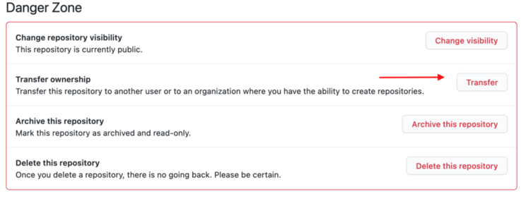
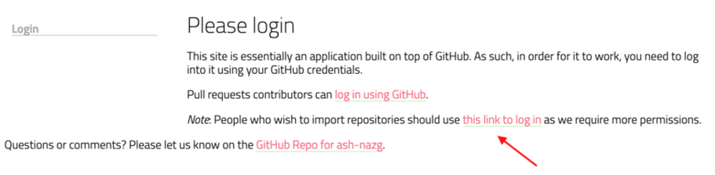
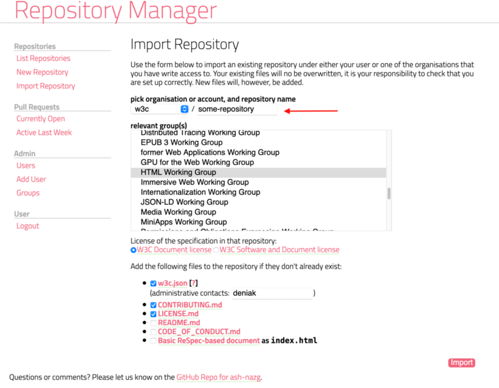

This document describes how to transfer a repository to the [W3C GitHub organization](https://github.com/w3c/).

[See also general information about GitHub repository transfer](https://docs.github.com/en/github/administering-a-repository/transferring-a-repository).

1. Make sure the [W3C GitHub organization](https://github.com/w3c/) doesn't already have a repository with the same name. If the name is already taken, the owner will need to rename the repository first
1. The repository owner initiates the transfer. This is done via the repo settings (see screenshot below):
   
   - If the owner is a W3C staff, they can transfer the repository directly to the W3C organization
   - If the owner is an individual that cannot create new repository under the W3C organization, they need to transfer the repository to a W3C staff who will then transfer to the organization
   - If the owner is another organization, a W3C staff first needs to join the organization [as an owner or admin of the repository](https://docs.github.com/en/github/administering-a-repository/transferring-a-repository#transferring-a-repository-owned-by-your-organization) to make the transfer and that staff will issue the transfer to the W3C organization
   
   

1. Once the transfer is done, the next steps vary depending on the nature of the repository (specifications development or tooling).

    - **If the repository is about specifications development**, it needs to be tracked by the [W3C repository manager](https://labs.w3.org/repo-manager/) to help ensure that contributions are properly managed under W3C patent policies. To add a repository to the W3C repository manager, someone with admin rights on the repository needs to import it via the ["import" tool](https://labs.w3.org/repo-manager/repo/import). The repository manager will offer to add some files (`w3c.json`, `CONTRIBUTING.md`, `LICENSE.md`, etc) if they don't already exist and will add a webhook to the repository.  
    **Be careful to select the right link to log in to the repository manager**.  
        
    
    - **If the repository is not about specifications development**, you only need to add a file [`w3c.json`](/w3c.json.md) at the root of the repository.

1. If the repository contained a specification published through GitHub Pages, also **consider adding redirects** because [Cool URIs don't change](https://www.w3.org/Provider/Style/URI)!

   When you transfer a repository, GitHub automatically redirects GitHub repo links (`https://github.com/[org]/[repo]`) but it does not redirect GitHub Pages links (`https://[org].github.io/[repo]`). That breaks former links to the specification. There is no direct way to create a redirect for GitHub Pages but the following steps can be used to redirect `https://[org].github.io/[repo]/` to `https://w3c.github.io/[repo]/`:

   - Create a `[org].github.io` repository under `[org]` if it does not exist already.
   - Create a `[repo]` folder in the `[org].github.io` repository.
   - Add an `index.html` file under the `[repo]` folder, which contains the following HTML code:  
  
     ```html
     <!DOCTYPE html>
     <script>
       const currentHash = window.location.hash;
       const newLocation = "https://w3c.github.io/[repo]/" + currentHash;
       window.location = newLocation;
     </script>
     ```
   See the [wicg.github.io repository](https://github.com/WICG/wicg.github.io) for examples of redirects set in place when WICG repositories transition to the W3C organization.
