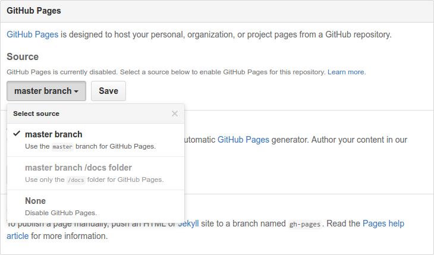

1. [Create a new GitHub repository](https://labs.w3.org/repo-manager/repo/new) using the [W3C Repository Manager](https://labs.w3.org/repo-manager/). The spec's *shortname* in lowercase is usually a good choice.
1. Once the new repository is created, find it on GitHub and set up [GitHub Pages](https://github.blog/developer-skills/application-development/simpler-github-pages-publishing/) to use the default branch, `main` (*Settings* / *Options* / *GitHub Pages*).
   
   
   
   The repository's contents will get *automagically* served from `https://username.github.com/reponame`.
   
   ⚠️ **NB:** be aware that [GitHub Pages have some limitations](faq.md#drafts).
1. Clone the repository locally.
   
   ```shell
   git clone https://github.com/username/reponame.git
   ```
1. Navigate to the repo.
   
   ```shell
   cd reponame
   ```
1. **Note: this step and the following are not needed if you set up your repository using the W3C Repository Manager as it can create a basic ReSpec document for you**.  
Now we want to create the spec document itself. I use [ReSpec](https://respec.org/docs/), so I simply copy the content of the [default template](https://respec.org/docs/#getting-started) into an `index.html` page at the root of my repository. And then add it to the repository.
   
   ```shell
   git add index.html
   git commit -m "Add empty doc."
   ```
1. Lets now push these changes back to our GitHub account.
   
   ```shell
   git push origin main
   ```
   
   The first time you push changes it can take a little while for the code to be published to your GitHub Pages subdomain, so be patient. But it'll be ready soon enough.
1. Set up your [favorite labels](issue-metadata.md)
1. Bask in the glory of modern spec development.

(For help and tips about Git itself, refer to [the dedicated page](git.md).)
