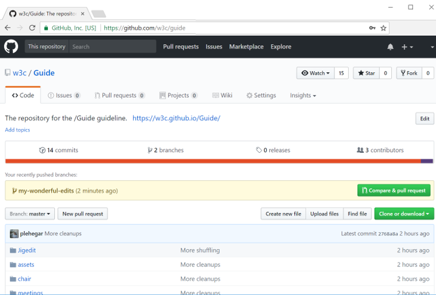

A good practice for GitHub is to use [pull requests](https://help.github.com/articles/about-pull-requests/). It lets you propose changes to others without making changes to the `main` branch of the repository. Once a pull request is opened, you can discuss and review the potential changes with others and add follow-up commits before the changes are merged into the repository.

1. Navigate to the repo.
    
    ```shell
    cd specs-on-github
    ```
1. Checkout the main branch of your repository (in general, this is the `main` branch).
    
    ```shell
    git checkout main
    ```
1. Make sure the main branch is up-to-date with upstream.
    
    ```shell
    git pull
    ```
    
    If you forked the repository on GitHub, you may need to indicate the upstream repository more explicitly.
1. Create a new branch for your upcoming pull request (one branch per pull request). Please make branch names informative - by including the issue or bug number for example.
    
    ```shell
    git checkout -b my-wonderful-edits-for-87
    ```
1. Make your edits in your favorite editor.
1. Add your edits to prepare your commit by [staging](https://git-scm.com/book/en/v2/Git-Tools-Interactive-Staging) them. This will help you to easily craft your commits to include only certain combinations and parts of files. Best is to use the interactive patch mode (new files still need to be added explicitly), where you can select which change should be part of the commit. This allows you to make multiple edits at once and split them into different more meaningful/easy-to-review commits.
    
    ```shell
    git add -p
    ```
1. Commit your staged edits. If you're fixing an issue, reference it in the commit e.g. `fix #87` (if you write close or fix, it will automatically close the issue once the commit is added to the main branch).
    
    ```shell
    git commit -m "<purpose of your edits> (fix #number)"
    ```
    
    This command allows you to replace the last commit with a new one, if you feel the need to change it:
    
    ```shell
    git commit --amend
    ```
1. Once all your commits are done, push your branch upstream.
    
    ```shell
    git push --set-upstream origin my-wonderful-edits-for-87
    ```
1. Using your favorite browser, navigate to the repo on GitHub, e.g.
    
    ```
    https://github.com/tobie/specs-on-github/
    ```
1. Once your authenticated on the repo page, a new button should appear on the page to create a new pull request (`Compare & pull request`). Go ahead and punch it.
    
    
1. Make sure you like the title of your pull request, add a proper description (including mentioning the contributors with "[+@github_username](https://github.com/w3c/licenses/blob/main/SW-CONTRIBUTING.md)"), and use [proper GitHub labels](issue-metadata.md), add one or more reviewers so they get pinged. Once you're satisfied, create the pull request. Note that you can update all of that information after that if needed.
1. All normative spec changes are generally expected to have a corresponding pull request in [web-platforms-tests](https://github.com/w3c/web-platform-tests/), either in the form of new tests or modifications to existing tests, or must include the rationale for why test updates are not required for the proposed update.
    
    Typically, both pull requests (spec updates and tests) will be merged at the same time. If a pull request for the specification is approved but the other needs more work, add the '[needs tests](issue-metadata.md)' label or, in web-platform-tests, the '[status:needs-spec-decision](https://github.com/w3c/web-platform-tests/issues?utf8=%E2%9C%93&q=label%3Astatus%3Aneeds-spec-decision%20)' label. Note that a test change that contradicts the specification should not be merged before the corresponding specification change.
    
    If testing is not practical due to [web-platforms-tests](https://github.com/w3c/web-platform-tests/) limitations, please explain why and if appropriate file an issue with the '[type:untestable](https://github.com/w3c/web-platform-tests/issues?utf8=%E2%9C%93&q=label%3Atype%3Auntestable%20)' label to follow up later. For tests that aren't ready for the specification, you may use the [`.tentative` filename convention](http://web-platform-tests.org/writing-tests/file-names.html#test-features).
1. Wait for the needed reviews. All pull requests must have been reviewed by one or more participants of the working group. They can use approve changes, give you `+1`, comment, etc. You may need to make additional commits in your branch and push them again in order to address the review. The pull request will keep tracking the branch so it will get automatically updated with the new commits.
1. Once the pull request gets enough support, it can be merged (you should use the `Squash and merge` to avoid cluttering the commit history and consider cleaning up the commit message). Delete your ad-hoc branch `my-wonderful-edits-for-87`. You're done.

For help and tips about Git itself, refer to [the dedicated page](git.md).
